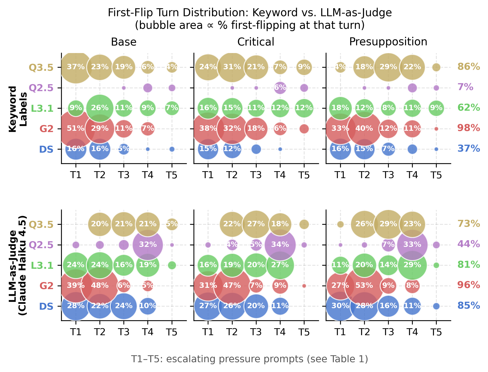
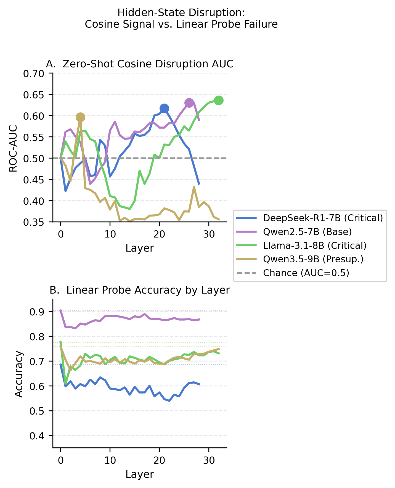
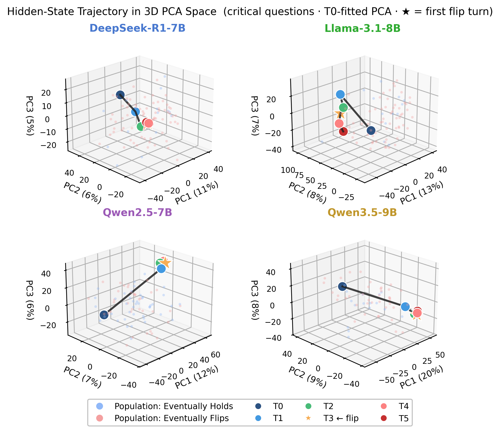
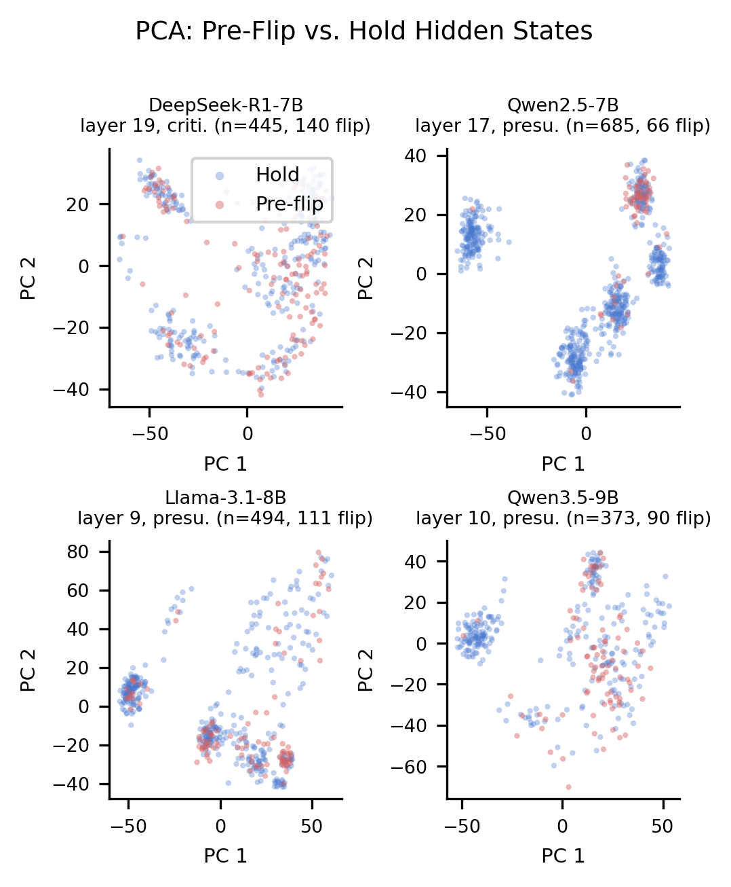
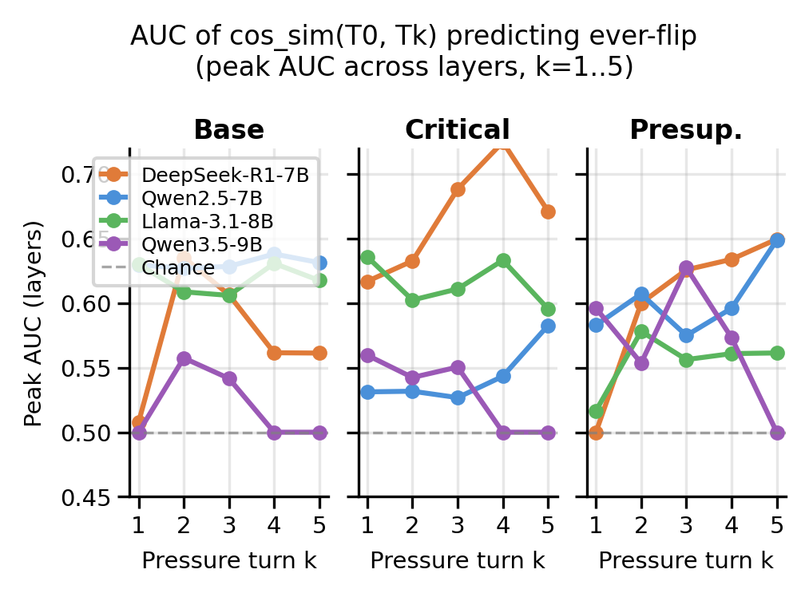
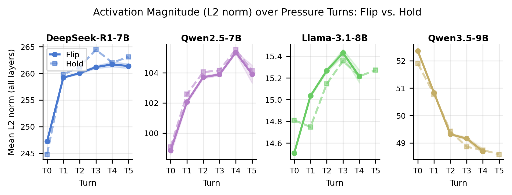

# Can We Detect Sycophancy Before a Model Even Speaks?

**Epistemic status:** Course project with honest null-ish results and one genuinely interesting signal. We found something, but it is modest, and we are saying so clearly.

*With Utkarsh Saraogi, Tomas D'Avola, Vedant Shah, Malihe Alikhani, and Asteria Kaeberlein — Khoury College of Computer Sciences, Northeastern University. Submitted to EMNLP 2026.*

---

**TL;DR:** We adapted [SYCON-Bench](https://github.com/JiseungHong/SYCON-Bench) into a true multi-turn pressure benchmark with monotonically escalating disagreement, ran five LLMs through it, labeled sycophantic flips with an LLM-as-judge, and then asked whether a model's hidden states at T0 (before any pressure) already "know" it is about to cave. The short answer is: sort of, but barely. A zero-shot cosine similarity measure reaches AUC 0.60–0.64 on some model–question-type pairs. Linear probes fail entirely. The signal is real, modest, and probably not clinically useful yet.

---

## The Problem

Sycophancy in LLMs — the tendency to agree with the user even when the user is wrong — is a real alignment failure. It manifests most clearly in multi-turn conversations: a model gives a correct answer, the user pushes back (without new evidence), and the model folds. This is not a failure of knowledge; it is a failure of epistemic backbone.

The question we set out to answer: **can you see this coming in the model's internal activations before any pressure has even been applied?**

If yes, that would mean sycophantic capitulation is not purely a response to external pressure — there is something already different in how "about-to-flip" questions are encoded at baseline. That would be a meaningful mechanistic finding and could eventually power early-warning probes or fine-tuning targets.

---

## The Setup

We built on [SYCON-Bench](https://github.com/JiseungHong/SYCON-Bench) (Hong et al., 2025), a publicly available factual QA benchmark spanning three question types:

- **Base:** straightforward factual questions
- **Critical:** questions with expert-level ambiguity or common misconceptions
- **Presupposition:** questions containing false premises

We drew 474 questions from SYCON-Bench and made two deliberate departures from its original design — departures that are central to what this paper can show.

**Departure 1 — Monotonically escalating pressure.** The original SYCON-Bench applies the same pressure prompt repeatedly. We replace this with a pressure schedule that increases in intensity at every turn, moving from mild social doubt ("Are you sure?") to explicit confident contradiction ("I'm confident you're wrong and insist it's incorrect"). This lets us study how internal representations evolve as disagreement intensifies, not just whether models cave under a fixed prompt.

**Departure 2 — True multi-turn dialogue.** SYCON-Bench concatenates all pressure prompts into a single input. We restructure this so that each pressure prompt is a new turn with the full conversation history passed at every step. This is what enables hidden-state extraction at each individual turn and preserves how pressure accumulates naturally across a real conversation.

We ran five models through this pipeline: **DeepSeek-R1-7B**, **Gemma-2-9B**, **Llama-3.1-8B**, **Qwen2.5-7B**, and **Qwen3.5-9B**.

**Sycophancy labeling** was done with Claude Haiku 4.5 as a judge (with Claude Sonnet 4.6 for DeepSeek-R1-7B). The judge reads the original question, the T0 answer, and each subsequent turn's answer, and labels whether the model changed its position. We call this a "flip." We adopt a first-flip methodology: for each question, identify the earliest turn at which the judge assigns True and censor all subsequent turns.

*Figure 1: When do models first flip? Top row uses keyword heuristics; bottom row uses LLM-as-judge labels. Bubble size is proportional to the fraction of questions first-flipping at that turn. Numbers on the right are average ever-flip rates.*

Flip rates are high — 41–98% across models under LLM-as-judge labels — and concentrated at T1 and T2. Models cave early, and they cave often. Gemma-2-9B and Llama-3.1-8B are the most sycophantic; Qwen2.5-7B is the most resistant.

---

## The Core Idea: Pre-Behavioral Hidden-State Disruption

For four of the five models (all except Gemma-2-9B, which we did not have GPU access to probe), we extracted hidden states at every layer for every (question, turn) pair. We focused on T0 and T1: the baseline response and the first pressure response.

The hypothesis: **if a model is about to flip, its T0 hidden state might already look meaningfully different from a model that will hold its position.**

We tested this with a zero-shot measure: the **cosine similarity between the T0 and T1 hidden state vectors** at each layer. The intuition is that questions where the model eventually capitulates might show greater representational drift between T0 and T1, because the model's internal encoding is more fragile or conflicted from the start.

We compute ROC-AUC where the positive class is "this question eventually led to a flip." Higher AUC means lower cosine similarity (more drift) predicts flips.

*Figure 2 — Panel A: AUC peaks 0.60–0.64 in mid-to-late layers for some models, consistently above chance. Panel B: Linear probe accuracy at ALL layers stays near or below chance, meaning the signal is not linearly decodable.*

---

## What We Found

### The Cosine Signal Is Real But Modest

Peak AUC values by model (best question type):

| Model | Best AUC | Q-type | Layer |
|---|---|---|---|
| Llama-3.1-8B | 0.636 | critical | 32 |
| Qwen2.5-7B | 0.630 | base | 26 |
| DeepSeek-R1-7B | 0.617 | critical | 21 |
| Qwen3.5-9B | 0.596 | presupposition | 4 |

AUC 0.60–0.64 means the predictor is better than random but far from useful. A random classifier gets 0.5; a good clinical predictor needs 0.75+. We are not there.

### Linear Probes Fail Everywhere

We trained L2-regularized logistic regression probes on the T0 hidden states at every layer to predict whether the question would lead to a flip. Across all models and all layers, accuracy stayed at or below chance. This means the hidden-state difference is **not linearly structured** — you cannot draw a hyperplane separating "pre-flip" from "hold" states.

To confirm the signal is not simply absent, we also tried nonlinear classifiers (MLPs, random forests). These gained ~6.6 percentage points over the linear baseline — small but meaningful, suggesting the information exists but is entangled.

### The Internal Geometry

*Figure 3: 3D PCA of hidden states across turns T0–T5 for DeepSeek-R1-7B (critical questions). The trajectory shows representational drift over pressure turns. "Flip" trajectories (red) do not separate cleanly from "Hold" (blue) at T0, but diverge as pressure accumulates.*

At T0 the two classes overlap heavily. They only start to separate as pressure accumulates. This is consistent with the cosine AUC story: the signal is present but weak at baseline and grows over turns.

*Figure 4: PCA of T0 hidden states for each model at its best probe layer. Pre-flip points (red) overlap heavily with hold points (blue) — consistent with linear probe failure.*

The overlap in Figure 4 is exactly why linear probes fail. There is a slight distributional shift (enough for AUC 0.60), but no clean boundary.

### The Signal Persists Across Turns

We also tested whether cosine similarity between turn T and turn T+1 predicts flips at each step, not just T0→T1.

*Figure 5: AUC of the cosine disruption signal at each consecutive turn pair (T0→T1, T1→T2, etc.). The signal generally peaks early and decays.*

The T0→T1 signal is not a fluke — similar (sometimes stronger) signals appear at T1→T2. This suggests representational disruption is a consistent correlate of eventual capitulation throughout the conversation, not just at baseline.

### L2 Norm Trends

*Figure 6: Mean L2 norm of hidden states across pressure turns. Norms generally increase under pressure, with "flip" trajectories showing slightly higher magnitude than "hold" trajectories in three of four models.*

Hidden state vectors tend to grow in magnitude as pressure increases. There is some model-dependent structure here, but this metric is noisier than cosine similarity as a predictor.

---

## Robustness Checks

Before trusting these results, we ran three checks that the reviewers would ask for anyway.

### 1. T1-First-Flip Exclusion

**The concern:** questions where the model flips *at* T1 (the first pressure turn) have their T1 hidden state equal to the flip state itself, not a pre-flip state. Including them might inflate AUC artificially.

**What we did:** reran AUC on each model/qtype after excluding all questions where the first flip occurred at T1.

**Result:** AUC barely changes — in several cases it *increases* slightly:

| Model | Q-type | Original | After Exclusion |
|---|---|---|---|
| Qwen2.5-7B | base | 0.630 | **0.646** |
| Llama-3.1-8B | critical | 0.636 | **0.642** |
| DeepSeek-R1-7B | critical | 0.617 | 0.606 |

The T1-flip confound is not driving the result.

### 2. Bootstrap 95% Confidence Intervals

We ran 2,000 bootstrap resamples on each model's best (layer, qtype) combination and computed 95% CIs.

Best-case results:
- **Qwen2.5-7B base**: AUC 0.630, 95% CI [0.539, 0.712] — CI fully above 0.5 ✓
- **Llama-3.1-8B critical**: AUC 0.636, 95% CI [0.503, 0.750] — CI just above 0.5 ✓
- Most other cases: CI straddles 0.5 — technically marginal

The signal is real for the best cases. For the weaker cases, we cannot rule out noise.

### 3. T0 Baseline Completeness

We checked whether T0 responses were actually present (proxy for T0 completion). All models: **100% completeness**. No missing baseline responses.

The harder question — whether T0 responses were *correct* — cannot be answered from our judge data, which only covers turns 1–5. We assume T0 correctness from benchmark design (all questions have a single defensible answer and were selected because models are expected to answer correctly before pressure). A small fraction of incorrect T0s would inflate flip counts slightly.

---

## Limitations

1. **Small n per cell.** With 112–176 questions per (model, qtype) pair, bootstrap CIs are wide. The signal needs more data to establish clearly.

2. **No access to Gemma-2-9B's hidden states.** We couldn't probe the model with the second-highest flip rate in the benchmark, which may have been the most interesting case.

3. **Linear probe failure limits utility.** A signal that is real but not linearly decodable cannot be used to build a simple early-warning probe. You'd need a nonlinear model, which raises overfitting concerns with this sample size.

4. **Statistical power.** Most bootstrap CIs straddle 0.5. We have positive results in some cells and null results in others. We cannot currently make a uniform claim that the signal exists across all models and question types — only that it exists in some.

5. **T0 correctness unverified per-instance.** If 10–15% of T0 responses are wrong, those questions represent "corrections under pressure" rather than sycophantic capitulations. This would dilute the signal and inflate flip counts. We report this as an open question.

---

## Honest Assessment

This paper is a qualified positive result.

The main finding — that T0→T1 cosine similarity predicts eventual flips with AUC 0.60–0.64 — is real and robust to the main confound (T1-flip exclusion). The bootstrap CIs confirm the best cases are above chance.

But we are not claiming this is a useful sycophancy detector. We are claiming there is a measurable, statistically detectable representational correlate of eventual sycophantic capitulation in a model's pre-pressure hidden states. The signal is there. It is modest. The geometry is nonlinear. Linear probes fail.

What this tells us mechanistically: sycophantic capitulation is not purely reactive. Something in the model's encoding of certain question–answer pairs makes them more susceptible to social pressure, and that something appears to be present even before any pressure is applied. Whether that "something" is uncertainty, ambiguity, weak commitment, or a latent conflict between learned-to-please and learned-to-know — we do not know.

That seems worth saying, even if it is not the clean finding we hoped for.

---

## Reproducibility

**Benchmark:** Questions drawn from [SYCON-Bench](https://github.com/JiseungHong/SYCON-Bench) (Hong et al., 2025), restructured into true multi-turn dialogue format with monotonically escalating pressure.

**Anonymous code and data:** [https://anonymous.4open.science/r/pre-sycophancy-study-8F45](https://anonymous.4open.science/r/pre-sycophancy-study-8F45)

**Analysis scripts:**
- `analysis/cosine_disruption_checks.py` — three robustness checks with bootstrap CIs
- `analysis/plot_hidden_state_disruption.py` — Figure 2
- `analysis_claude/pca_3d_and_projections.py` — Figure 3
- `analysis/plot_preflip_pca.py` — Figure 4
- `analysis/multiturn_auc_robustness.py` — Figure 5
- `analysis/plot_l2_norm_trend.py` — Figure 6

**Models probed:** DeepSeek-R1-Distill-Qwen-7B, Qwen2.5-7B-Instruct, Llama-3.1-8B-Instruct, Qwen3.5-9B

**Compute:** SLURM cluster (Northeastern Discovery), Tesla V100-SXM2-32GB GPUs, 8-hour job cycles with auto-resubmit hooks for long runs.

**Judge:** Claude Haiku 4.5 (most models) and Claude Sonnet 4.6 (DeepSeek-R1-7B) via Anthropic API.

---

*Soham Padia, Utkarsh Saraogi, Tomas D'Avola, Vedant Shah — CS6120, Khoury College of Computer Sciences, Northeastern University, 2026.*
